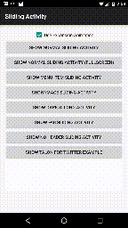
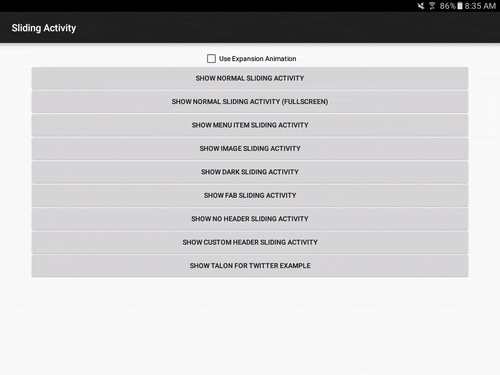

# Android Sliding Activity Library




Easily create activities that can slide vertically on the screen and fit well into the Material Design age.

## Features

Sliding activities allow for you to easily set header content, menus, and data onto a slidable screen. The library currently supports a variety of custom features that allow you to make the screen unique. Currently support are the following:

 - Set the title and have this title shrink into the toolbar as you scroll
 - Set a header image that disappears into the toolbar as you scroll
 - Set colors that will affect the header and status bar color
 - Add a floating action button to the bottom of the header that will animate and show/hide itself at the correct time
 - Disable the header and show only content that is scrollable
 - Works with [PeekView](https://github.com/klinker24/Android-3DTouch-PeekView) out of the box, to provide a "3D Touch" effect on your views. See example usage in the [TalonActivity](https://github.com/klinker41/android-slidingactivity/blob/master/sample/src/main/java/com/klinker/android/sliding/sample/TalonActivity.java) sample.

 

## Installation

Include the following in your gradle script:

```groovy
dependencies {
    compile 'com.klinkerapps:sliding-activity:1.5.2'
}
```

and resync the project.

## Example Usage

Sliding activities are very easy to implement. Here is a simple example:

```java
public class NormalActivity extends SlidingActivity {

    @Override
    public void init(Bundle savedInstanceState) {
        setTitle("Activity Title");

        setPrimaryColors(
                getResources().getColor(R.color.primary_color),
                getResources().getColor(R.color.primary_color_dark)
        );

        setContent(R.layout.activity_content);
    }
}
```

This will create an activity with the given title, the primary colors, and whatever is included in the activity_content layout.

You also need to reference the activity into your AndroidManifest.xml:

```xml
<activity
    android:name=".NormalActivity"
    android:excludeFromRecents="true"
    android:taskAffinity=""
    android:theme="@style/Theme.Sliding.Light"/>
```

More Details:
First, extend SlidingActivity. Instead of overriding onCreate(), instead override init() and set all of your options for the app there. These options include:

 - setTitle()
 - setImage()
 - setContent()
 - setPrimaryColors()
 - setFab()
 - disableHeader()
 - enableFullscreen()

More examples of possible activities can be found in the sample application and code snippets will be shown below.

You can configure the scroller before it's initialised by overriding configureScroller(scroller)

```java
@Override
    protected void configureScroller(MultiShrinkScroller scroller) {
        super.configureScroller(scroller);
        scroller.setIntermediateHeaderHeightRatio(1);
    }
```

## Activity Options

Most activity options should be implemented inside init(). You can implement setImage() anywhere after init(), but none of the others should be outside of this method.

#### setTitle()

Setting the title so that it fades into the toolbar as the scrolling occurs is very easy. You can either do:

```java
setTitle(R.string.title);
```

or

```java
setTitle("Activity Title");
```

#### setImage()

You can either set a drawable resource id or a bitmap as the image:

```java
setImage(R.drawable.header_image);
setImage(mBitmap);
```

When setting the image for the image, there are two options:
1) Set it inside init()
2) Set it outside init()

Both of these have very different functionality, so it is important to understand the difference.

If you have a drawable included in your project or already have a bitmap loaded in memory, then it would be best to set the image inside of init(). This will cause the activity colors to change based off of the image and it will show the image when the activity is scrolling up from the bottom.

If you need to load the image from a url or memory, you should not do this on the main thread. This means you need to set it after you've already initialized the activity. When doing this, the image will be animated in with a circular reveal animation (for lollipop+ users) or a fade in animation. Also, the activity will not look at the image and extract colors from it. It will instead use whatever colors you've set as your primary colors.

#### setContent()

Setting content is handled the same way as setting content in a normal activity. You can either pass a layout resource id or a View:

```java
setContent(R.layout.activity_layout);
setContent(mView);
```

After you have set the content, it will be available with ```findViewById()```, same as it would with a normal activity.

#### setPrimaryColors()

The primary color will be used to color the header when no image is present and the primary color dark will be used to color the status bar when the activity has been scrolled all the way to the top of the screen.

```java
setPrimaryColors(primaryColor, primaryColorDark);
```

One thing to note here, setting an image inside of init() will override these colors. If you wish to continue specifying your own custom colors instead of using the image's extracted colors, call setPrimaryColors() AFTER setImage().

#### setFab()

A floating action button can be shown at the bottom of the expanded toolbar and acted on if you need that for your activity.

```java
setFab(mBackgroundColor, R.drawable.fab_image, onClickListener);
```

When the user scrolls and the header begins to shrink, the FAB will be hidden from view. When the header has returned to its original size, the FAB will be shown again.

#### disableHeader()

If you would like to not show the header on the screen and only have your scrolling content animate up, you can call ```disableHeader()``` inside init().

#### enableFullscreen()

If you would like to not have the scrolling content animate up onto the screen and leave a little bit of extra room at the top, you can call ```enableFullscreen()``` inside init(). After doing this, the activity can still be slid down to dismiss it.

#### expandFromPoints(int,int,int,int)

This property creates an [Inbox](https://play.google.com/store/apps/details?id=com.google.android.apps.inbox) style expansion from anywhere on the screen. As with many methods, the parameters are left offset, top offset, width, and height, which describe the size of the box that you want to expand from.

``` java
Intent intent = getIntent();
if (intent.getBooleanExtra(SampleActivity.ARG_USE_EXPANSION, false)) {
    expandFromPoints(
            intent.getIntExtra(SampleActivity.ARG_EXPANSION_LEFT_OFFSET, 0),
            intent.getIntExtra(SampleActivity.ARG_EXPANSION_TOP_OFFSET, 0),
            intent.getIntExtra(SampleActivity.ARG_EXPANSION_VIEW_WIDTH, 0),
            intent.getIntExtra(SampleActivity.ARG_EXPANSION_VIEW_HEIGHT, 0)
    );
}
```

My suggestion: in the [SampleActivity.addExpansionArgs(Intent)](https://github.com/klinker41/android-slidingactivity/blob/master/sample/src/main/java/com/klinker/android/sliding/sample/SampleActivity.java) function, you can see that I pass the expansion parameters as extras on the intent. I would recommend using this method to pass the view from the activity under the SlidingActivity, to the SlidingActivity.

#### Theming

Two themes are included with the library that are specifically created for a SlidingActivity. You can use either ```Theme.Sliding``` or ```Theme.Sliding.Light``` when registering your sliding activity in the AndroidManifest.xml file. You can also use these themes as a parent to your own custom themes and use those instead if you would like.

## Current Apps Using Sliding Activities

 - [Talon for Twitter](https://play.google.com/store/apps/details?id=com.klinker.android.twitter_l)
 - [EvolveSMS](https://play.google.com/store/apps/details?id=com.klinker.android.evolve_sms)

If you're using the library and want to be included in the list, email me at <jake@klinkerapps.com> and I'll get your app added to the list!

## APK Download

If you'd like to check out the sample app first, you can download an APK [here](https://www.dropbox.com/s/zpr0ykwl07539uq/sliding-activity-sample.apk?dl=0).

## YouTube

Much higher quality than the GIFs above and more options shown: https://www.youtube.com/watch?v=fWcmy7q09aM

## Contributing

Please fork this repository and contribute back using [pull requests](https://github.com/klinker41/android-slidingactivity/pulls). Features can be requested using [issues](https://github.com/klinker41/android-slidingactivity/issues). All code, comments, and critiques are appreciated.

## Changelog

The full changelog for the library can be found [here](https://github.com/klinker41/android-slidingactivity/blob/master/CHANGELOG.md).

## Credits

Credit to the good folks who work on Android. In the contacts app on Lollipop, there is a quick contact activity that was the base implementation for this library. Check it out [here](https://github.com/android/platform_packages_apps_contacts).

## License

    Copyright (C) 2016 Jacob Klinker

    Licensed under the Apache License, Version 2.0 (the "License");
    you may not use this file except in compliance with the License.
    You may obtain a copy of the License at

    http://www.apache.org/licenses/LICENSE-2.0

    Unless required by applicable law or agreed to in writing, software
    distributed under the License is distributed on an "AS IS" BASIS,
    WITHOUT WARRANTIES OR CONDITIONS OF ANY KIND, either express or implied.
    See the License for the specific language governing permissions and
    limitations under the License.
